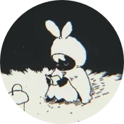

# Team
{ align=left }
## billiam

My name is *billiam*, a [content creator](https://youtube.com/@biriamu) who currently makes Project SEKAI and tech-related content! 

In my free time, I like to play rhythm games like [Project SEKAI](https://colorfulstage.com/). I also enjoy watching anime, reading manga, and playing visual novels.

My favorite characters in Project SEKAI are [Saki Tenma](https://youtu.be/YX_KybZgVxA) and [Honami Mochizuki](https://youtu.be/kgahc1Yvlao).

My favorite anime is *[Clannad](https://myanimelist.net/anime/2167/Clannad)* and its sequel, *[Clannad: After Story](https://myanimelist.net/anime/4181/Clannad__After_Story)*. It's an old slice of life anime from 2008 and is also the first anime series I have ever watched. I don't think a piece of media has moved me as much as this series has, so it's something that I won't be able to forget for a very, very long time if not ever.

From time to time, I also watch tech videos and dabble in computer/mobile device related projects such as PC building, keyboard building, custom software installation, software configuration, and more.

As the creator of Kyoushitsu B, I hope the information found in this Wiki will be valuable towards your next Full Combo or All Perfect!

 - billiam 

[YouTube](https://youtube.com/@biriamu){.md-button }

---
{ align=left }
## Tpulse

Hi! I’m Tpulse, and I’ve played Project SEKAI since July 2023. I’m currently grinding for Full Game AP on the global (en) server. My current highest AP is Marbleblue Append (Lv.37). I also started playing hololive dreams since its release. I have released a few custom charts on holodori and on Sonolus.

Other than Proseka, I also play Genshin Impact and Blue Archive. I’m also a speedcuber (big cube main, so 4x4-7x7).

I’m a very big yuri fan and I recently got into the Love Live franchise. If you want more recommendations, feel free to DM me on discord (thunderingpulse8544)
Anime recommendations: 86, Lycoris recoil, Cosmic princess kaguya, Bloom into you, Love live
Manga recommendations: Whisper me a love song, The summer you were there, The anemone feels the heat, Please bully me miss villainess, I want to love you till your dying day

I hope this Wiki can help you improve at rhythm games, no matter your skill level!

[YouTube](https://www.youtube.com/@Tpulse8544){.md-button }

---
{ align=left }
## reverie

Hi I’m reverie but most people know me as rev. I’ve played Project SEKAI for nearly 4 years at this point (Nene Kusanagi and Ena Shinonome are my oshis!) and I sometimes upload my high difficulty achievements to YouTube! I don’t play nearly as much as I used to but it still has a special place in my heart! I’ve also dabbled in Custom Chart making on Sonolus.

Some of my favorite games other than Project SEKAI include: NieR: Automata, Hollow Knight, Scarlet Nexus, and Zenless Zone Zero!

As for anime, my favorites are My Teen Romantic Comedy, 86, and Attack on Titan! Although I rarely watch anime nowadays.

I hope you can use this Wiki to your advantage on your rhythm game journey!

[YouTube](https://youtube.com/@reverie5706){.md-button }

---

